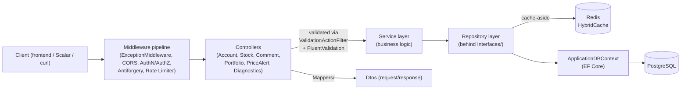

# Architecture

This document describes how the DOL-FIN backend (`backend/`) is actually put
together, plus a short pointer to the frontend's structure. See
[README.md](./README.md) for the two-repo/deploy-topology context this
builds on.

> **Note on naming:** this is a pragmatic **layered architecture**
> (Controller → Service → Repository → EF Core), not "Clean Architecture"
> (no separate Domain/Application/Infrastructure assemblies) and not CQRS
> (no command/query/MediatR split) — the codebase doesn't use either
> pattern, so this doc describes what's actually there instead of
> retrofitting fashionable labels onto it.

## Backend: request flow



A request enters through the middleware pipeline, is routed to a
controller action, has its request DTO validated by the global
`ValidationActionFilter` (FluentValidation rules live in `Validation/`, not
scattered `if` checks in controllers), then the controller delegates to a
service. Services hold business logic and call repositories through their
`Interfaces/` abstractions; some repositories (`CachedStockRepository`,
`CachedCommentRepository`) wrap a plain repository with a Redis-backed
`HybridCache` cache-aside layer, invisible to the controller. Entities go
back out through `Mappers/` into response DTOs — EF Core entities never
serialize directly onto the wire.

## Folder structure (`backend/`)

```
Controllers/     API endpoints — thin: parse request, call a service, map the result.
Service/         Business logic: PortfolioService, PortfolioAnalyticsService,
                 RebalancingService, PriceAlertService (+ its background job),
                 PriceSimulationService (+ its background job and the pure
                 PriceWalk rules), TokenService, CacheWarmingService.
                 Both background jobs read an options record bound from
                 configuration (PriceAlertOptions, PriceSimulationOptions) and
                 can be switched off through it -- the integration tests do
                 exactly that so neither timer perturbs a running test.
Repository/      Data access behind Interfaces/ — StockRepository, CommentRepository,
                 PortfolioRepository, PriceAlertRepository, TransactionRepository,
                 UnitOfWork, plus the Cached* decorators mentioned above.
Interfaces/      DI abstractions every service/repository is registered and consumed
                 through (constructor injection, no static/service-locator access).
Validation/      FluentValidation validators (one per request DTO) + the global
                 ValidationActionFilter and ValidationProblemFactory that turn
                 failures into a standard ValidationProblemDetails response.
Dtos/            Request/response contracts, grouped by feature (Account, Stock,
                 Comment, Portfolio, Alerts).
Mappers/         Entity <-> Dto conversions (extension methods, no AutoMapper).
Models/          EF Core entities (AppUser, Stock, Comment, Portfolio, Transaction,
                 PriceAlert, AlertNotification, ...).
Data/            ApplicationDBContext, its design-time factory, and StockSeeder.
Migrations/      EF Core migrations (applied automatically on startup).
Caching/         CacheKeys/CacheConfiguration (single source of truth for keys & TTLs),
                 CacheMetrics (hit/miss counters exposed via /api/diagnostics).
MiddleWare/      ExceptionMiddleware — converts unhandled exceptions into a
                 consistent ExceptionResponse instead of leaking stack traces.
Diagnostics/     NPlusOneDetectionInterceptor — an EF Core interceptor that flags
                 N+1 query patterns above a configurable threshold in dev/logs.
Extensions/      Small cross-cutting helpers (e.g. ClaimsExtensions for reading the
                 current user's id/roles off the JWT claims).
Helpers/         QueryObject/CommentQueryObject — filter/sort/paging parameter objects.
api.Tests/              xUnit unit tests (EF Core InMemory + Moq) — see below.
api.IntegrationTests/   xUnit integration tests (Testcontainers) — see below.
```

## Cross-cutting concerns

- **Auth:** ASP.NET Core Identity + JWT, but the token is delivered via an
  httpOnly cookie rather than handed to JS — `AccountController` issues it,
  `TokenService` creates it, `ClaimsExtensions` reads the current user off
  it in every other controller. CSRF is covered separately via the
  double-submit `IAntiforgery` cookie pattern on state-changing requests.
  Controllers are `[Authorize]` by default and open up per action: the
  catalog reads (`StockController.GetAll/GetById/GetMarketTrends`) and the
  comment reads carry `[AllowAnonymous]` so a visitor can browse before
  signing up, while everything wallet-shaped stays behind the wall. Two unit
  test files assert those attributes per action, because the difference
  between "open" and "leaked" here is one attribute.
- **Validation:** every request DTO has a matching FluentValidation
  validator in `Validation/`; the single `ValidationActionFilter` action
  filter runs them for every action model-bound to a DTO, so there is no
  path where a controller re-implements ad hoc validation.
- **Caching:** cache-aside via `HybridCache` (in-process L1 + Redis L2),
  applied at the repository boundary through the `Cached*Repository`
  decorators — controllers and services are unaware caching exists. Keys
  and TTLs are centralized in `Caching/CacheKeys.cs` /
  `Caching/CacheConfiguration.cs`. Every cache operation is wrapped in
  try/catch that falls back to a direct DB read on a Redis failure — a
  Redis outage degrades latency, it doesn't break the app (`/health`
  reports Redis as `Degraded`, not `Unhealthy`, for the same reason).
- **Errors:** `ExceptionMiddleware` is the single place unhandled exceptions
  are caught and turned into a consistent JSON `ExceptionResponse`.
- **API docs:** every controller action carries an XML doc comment
  (`<summary>`, `<param>`, `<response>`); .NET 10's OpenAPI source generator
  turns those into the descriptions shown on `/scalar`. Because
  `GenerateDocumentationFile` is on but `CS1591` is suppressed, an
  undocumented action still compiles clean and just shows up bare in the UI —
  so an integration test asserts every operation in `/openapi.json` has a
  summary rather than relying on the compiler to catch it. Only controller
  actions are documented; DTOs and services deliberately are not.
- **Unit of work:** multi-step writes (e.g. a trade that touches both a
  `Portfolio` position and a `Transaction` row) go through `IUnitOfWork` so
  they commit or roll back together.

## Testing strategy

Two separate test projects, both excluded from `api.csproj`'s own compile
(`<Compile Remove>` in `api.csproj`) so they never end up shipping inside
the API's own build output — they're only reachable by building/testing
their own `.csproj` (or the solution that references them, `backend/api.sln` or
the root [`DOLFIN.sln`](./DOLFIN.sln)):

- **`api.Tests`** — unit tests. Repositories are tested against EF Core's
  `InMemory` provider (`TestHelpers/InMemoryDbContextFactory.cs`); services
  and anything with external dependencies are tested via Moq
  (`TestHelpers/MockUserManager.cs` mocks `UserManager<AppUser>`).
  Coverage spans repositories, services, mappers, validators, caching
  metrics, and the N+1 detection interceptor — 25+ test files.
- **`api.IntegrationTests`** — endpoint tests against a real PostgreSQL +
  Redis, spun up per test run via **Testcontainers**
  (`DolfinApiFactory.cs` boots a `WebApplicationFactory` against those
  containers; requires Docker running locally). Covers auth flow, CRUD
  endpoints, caching behavior, health checks, validation error shapes, and
  the generated OpenAPI document itself.

Both run in CI on every push that touches `backend/**`
([`.github/workflows/backend-ci.yml`](./.github/workflows/backend-ci.yml))
as two separate jobs — `build-and-test` for unit tests, `integration-tests`
for the Testcontainers suite — alongside a third `docker-build` job.

```bash
cd backend
dotnet test api.sln                                          # everything
dotnet test api.Tests/api.Tests.csproj                        # unit only
dotnet test api.IntegrationTests/api.IntegrationTests.csproj  # integration only (needs Docker)
```

## Frontend structure (brief)

The frontend (`frontend/src/`) is a standard feature-oriented React/Vite
layout — `Pages/` (routed screens), `Components/` (shared UI, including
`Components/Alerts/` — the navbar notification bell and the wallet's alert
list), `Context/` (React context providers, e.g. auth state), `Services/`
(Axios calls into the API, see `Helpers/AxiosInstance.tsx` for the base
URL/interceptor setup), `Routes/` (route definitions), `Models/`
(TypeScript types mirroring the API's DTOs), `Helpers/`. End-to-end tests
live in `frontend/e2e/` (Playwright, selects elements by accessible name —
see the deploy-topology warning in [README.md](./README.md) about why UI
changes can break these).

Unit tests sit next to what they cover as `*.test.ts(x)` and run under
Vitest + React Testing Library (`npm test`; Playwright is deliberately
excluded from that run and lives behind `npm run test:e2e`). They
concentrate on the layers where a regression is silent rather than on
markup: the auth context and route guard, the Axios instance's
cookie/CSRF behaviour, the service layer's request shapes, the demo data
readers' return contract, and the number formatters. See
[README.md](./README.md) for the full feature list and setup.
